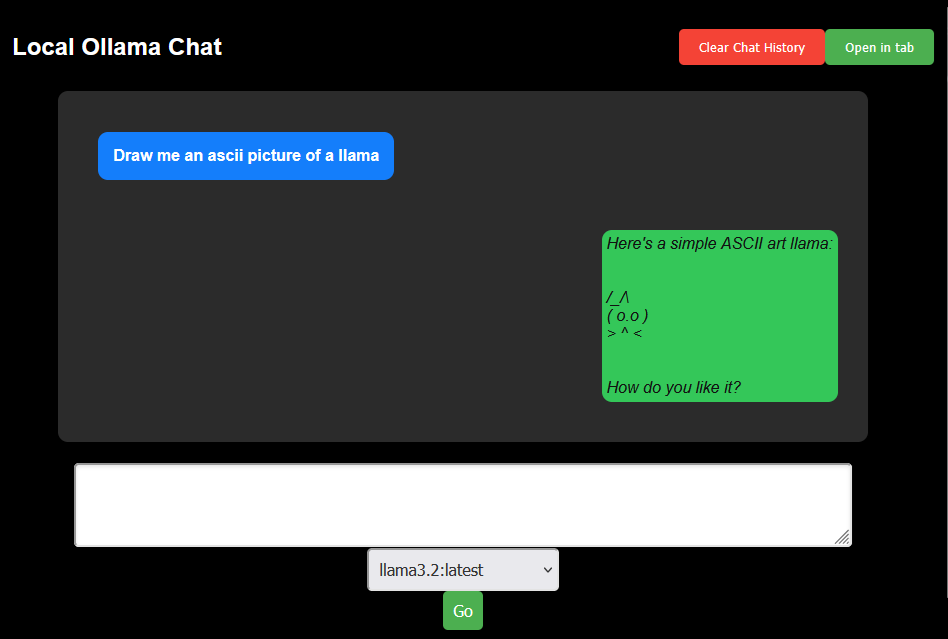

# OllamaFireFox
A simple UI for interacting with OLLAMA locally in your browser.

## To Use
Make sure OLLAMA is running locally with environment variables for OLLAMA_ORIGINS='moz-extension://*' and OLLAMA_HOST=127.0.0.1
If you are querying a model that takes images, they can be pasted in from the text box.

## TODO
Add button to remove chat history  
Error handling and logging 
